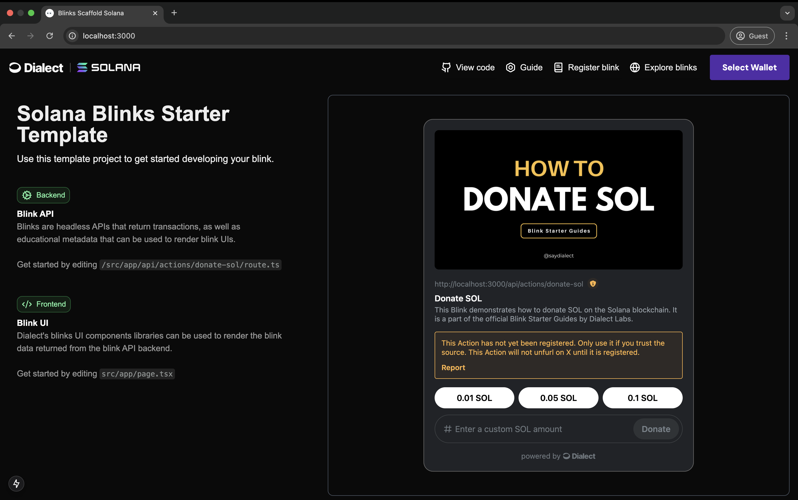

# Blink Starter for Solana

Blink scaffold Solana acts as a downloadable and reusable template that utilizes NextJS and Tailwind as the front end framework plus API routes for the backend. It comes with all necessary dependencies and configuration out of the box, so that you can immediately start building.

The blink in the starter template showcases a simple donation application that allows users to send SOL (Solana's native currency) to a specified wallet address.



## Guide 🔥🔥🔥

Learn how to build this Blink from scratch with our extensive guide:
https://docs.dialect.to/blinks/blinks-provider/build-your-first-blink

## Prerequisites

- Node.js 18+
- npm, yarn, pnpm, or bun
- A wallet with some devnet SOL (if you want to test the blink)

## Features

- Nextjs React framework
- Tailwind
- Blink SDK
- Solana Web3.js
- Dark/Light Mode
- Solana Wallet Adapter

## Getting Started

1. Clone repository:

```bash
git clone https://github.com/dialectlabs/blink-starter-solana.git
```

2. Install dependencies:

```bash
npm install
```

3. Run the development server:

```bash
npm run dev
```

4. Rename `.env.example` to `.env` and add the donation wallet address in the .env file

5. Open [http://localhost:3000](http://localhost:3000) with your browser to see the application.

## License

MIT
